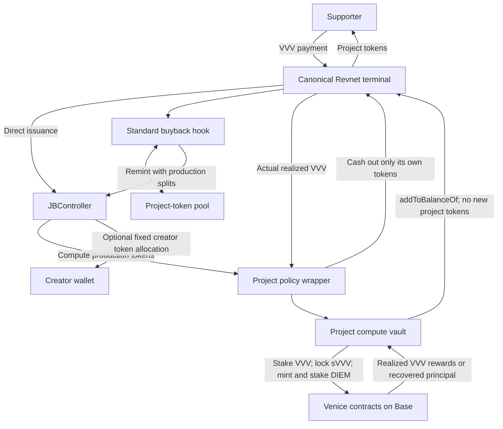

# Telligence architecture

Draft decision record, September 9, 2026. This document describes proposed behavior. Local source inspection is not deployment or audit evidence.

## Product contract

A creator explains what they want to accomplish. The launch form does not ask for a daily compute target; usable capacity is determined by activated backing and verified provider credit. Supporters fund its Revnet. An explicitly allocated portion of the Revnet's production builds a compute endowment. The creator receives a Telligence API key and a compatible base URL. Their dashboard shows daily capacity, today's remaining credit, usage, and service health.

The promise is recurring Venice inference while the endowment and provider support it. It is not arbitrary GPU rental, model training, unlimited inference, a fixed number of model tokens, or a guarantee of perpetual service. Existing capacity need not stop just because new contributions stop. Support grows capacity as the wrapper realizes additional VVV; model prices and workload determine how much work that capacity buys.

Tokens can disappear from the primary workflow, but economic rights cannot disappear from the funding confirmation. Explain that supporters receive Revnet project tokens, that exits follow its cashout rules, and that compute backing is separate from currently liquid reserve. A supporter is not automatically buying API access, a donation receipt, profit sharing, or an original-contribution refund.

## Proposed defaults

The design keeps standard Revnet buybacks, as agreed. Numerical economic parameters remain to be selected:

- Base mainnet only, chain ID 8453. Canonical VVV is the sole terminal accounting asset and issuance base currency.
- One Revnet, one policy wrapper, one compute vault, and one provider identity per project. No shared pool of project credit or collateral. Retain standard Revnet payment and cashout routing, including buybacks.
- Compute is funded by cashing out wrapper-owned production tokens. The wrapper does not borrow. Other stock Revnet holders retain their protocol loan rights.
- The creator can use compute and manage application keys. Version 2 can also lock a creator token allocation at launch. Those tokens retain ordinary transfer and cashout rights against liquid treasury; the creator has no privileged withdrawal access to the compute vault and cannot redirect production after launch.
- Minted DIEM stays with its minting position and is staked. No DIEM sale, lending, collateral reuse, or automatic strategy switching.
- Initially, all realized VVV staking rewards return to the same Revnet via `addToBalanceOf`. Compounding can be a separate versioned preset after modeling; do not add an arbitrary yield-allocation control to v1.
- Winddown follows a published notice policy and returns recovered VVV to the same Revnet. It does not make historical donors individually whole.
- Telligence provides a gateway key. A direct Venice key is a later adapter option if contract-wallet key provisioning and revocation are proven.

## The money path



This is a supported use of the existing economic interfaces, with new policy contracts around them. Stock v6 Revnet fixes the canonical treasury terminal and gives ordinary payouts zero allowance; its production splits distribute newly issued project tokens. A split hook does not itself authorize withdrawal of the treasury's VVV. See [REVDeployer.sol](../../../revnet-core-v6/src/REVDeployer.sol), especially `_makeLoanFundAccessLimits`, `_makeRulesetConfiguration`, and `_makeTerminalConfigurations`.

The wrapper converts production tokens into VVV through an explicit, quoted cashout using standard Revnet routing. Proceeds may come from terminal reserve or an AMM route. VVV paid from the terminal reduces its recorded reserve; AMM proceeds are not fresh treasury deposits. The vault commits the actual received VVV to compute. Yield and winddown proceeds use [`addToBalanceOf`](../../../nana-core-v6/src/JBMultiTerminal.sol), which adds value without minting project tokens. Using `pay` for this recycling would issue additional tokens and introduce self-funding loops.

A production split is not a fixed percentage of deposited money. In a simplified first raise using direct issuance and the terminal cashout curve, with no other balances, loans, or fee adjustments, gross cashout is:

```text
compute VVV before fees = raised VVV × r × (1 − t + t × r)
r = production-token fraction
t = cashout tax, expressed as a fraction
```

For example, r=0.40 and t=0.60 yields 25.6% of the raise before fees, not 40%. This follows the [core cashout curve](../../../nana-core-v6/src/libraries/JBCashOuts.sol). It is a baseline example, not the quote for an AMM-routed payment or cashout. The full route simulation, live effective supply, fees, liquidity, and received balance determine executable amounts. A cashout tax near the maximum can make small production allocations especially inefficient; economic presets must be modeled before launch.

Batch timing also changes value. A keeper must execute a prescribed batch policy rather than choosing arbitrary tiny cashouts. Define cadence, minimum economical batch, maximum allocation, and output guards onchain. Fundraising and activation should be separate operations so a Venice outage cannot revert a supporter payment. Show the expected activation delay, including any Revnet cashout delay.

## Creator token allocation

The webclient keeps the compute issuance allocation at 40% and lets the creator
choose an operator allocation from 0% through 59.99%; funders receive the
remainder. The default operator allocation is 0%. Factory version 2 supports
separate compute and creator allocations, each expressed against all newly
issued tokens; the total reserved percentage is their sum. The factory caller
is the fixed creator beneficiary. The policy remains the sole protocol operator.

For 40% compute / 10% operator / 50% funders, stock Revnet reserves 50% of new
issuance and routes those reserves 80/20 to the compute policy and creator.
Both recipients are permanently locked, and their ratio cannot change between
stages because stock core distributes accrued reserves using current-stage
recipients. Integer recipient weights round toward compute; ordinary token
rounding remains documented in the [contract semantics](../contracts/README.md).

These shares do not promise permanent ownership or direct payouts. Creator
tokens can cash out against liquid treasury before any project revenue and
participate in returned backing while held. They do not grant direct access to
vault assets. The [executable allocation economics](../contracts/test/economics/operator-split.md)
characterize early creator exits and conversion order. Standard buybacks remain
available; a payment can acquire existing tokens rather than trigger new issuance.

## Contracts and authority

| Component | Responsibility | Authority boundary |
|---|---|---|
| `TelligenceFactory` | Atomically create/bind the Revnet, policy wrapper and vault; register versioned policy | Validates exact chain, addresses, every stage, VVV accounting, empty bridging configuration, and pinned recipients |
| `ProjectPolicy` | Act as Revnet operator; receive production tokens; enforce conversion and return policy | No generic execute, delegatecall, operator handoff, arbitrary splits, treasury allowances, pool changes, or bridging |
| `ComputeVault` | Own VVV, sVVV, DIEM and their staking/locking positions | Typed calls to pinned integrations; fixed beneficiaries; bounded deployment of assets; recovery returns only to its Revnet |
| `VeniceAuth` logic in vault | Validate short-lived provider authentication using a dedicated inference signer | Cannot authorize transfers, permits, approvals, policy changes, or generic contract-wallet execution |
| Creator/recovery roles | Manage metadata and application credentials; schedule winddown under disclosed policy | No privileged vault withdrawal or routing powers. Creator tokens retain ordinary holder rights. |
| Keeper | Trigger operations permitted by contract state and policy | Small gas wallet; no principal custody; others can run the same operations |

Use immutable versioned contracts or clones whose implementation cannot be replaced. A new audited adapter version launches new projects; migration of existing assets requires a separately specified, visible recovery path. Upstream Venice contract upgrades remain an external trust dependency even if Telligence is immutable.

The wrapper is the Revnet operator from initial deployment. Do not temporarily give an EOA broad authority. Production splits must be checked for every stage, including default/future split groups. Stock operator permissions include split changes and several other powers; configuration hashes omit individual split recipients and weights. Consequently, checking a config hash does not prove the compute beneficiary. Use a long-lived split lock for the committed period plus wrapper-enforced routing. See [REVOwner](../../../revnet-core-v6/src/REVOwner.sol), [REVDeployer](../../../revnet-core-v6/src/REVDeployer.sol), and [JBSplits](../../../nana-core-v6/src/JBSplits.sol).

Separate `ProjectPolicy` from the authenticating vault. Revnet operator authority and `SIGN_FOR_ERC20` must never be reachable through the hosted inference signer.

Treat the factory binding as immutable identity: `(chainId, revnetId, wrapper, vault, policyVersion)`. Deployment must avoid uninitialized clones and predictably addressed vaults being claimed by someone else. Pin verified protocol deployments rather than trusting arbitrary client-supplied addresses or metadata.

## Accounting

Use integer base units for every monetary amount. Pin the canonical Base VVV address, read and verify decimals, and set both accounting currency and issuance base currency to the SDK's `tokenCurrencyId(VVV)`. Never infer token identity from its symbol. VVV-to-VVV protocol math does not need a USD price feed. USD display and input-token swap quotes are separate, timestamped estimates.

Keep distinct ledgers for:

1. VVV actually available in the terminal, plus protocol cashout/loan calculations.
2. Production project tokens accrued but not yet cashed out.
3. VVV held by the wrapper/vault and VVV already staked.
4. sVVV locked per DIEM mint position and the DIEM needed to release it.
5. DIEM liquid, staked, in cooldown, or awaiting claim.
6. Provider-reported daily allocation and remaining credit.
7. Gateway request reservations, settled usage, and uncertain in-flight usage.

Do not add locked sVVV value and minted DIEM market value as if they were independently redeemable assets. Do not count provider credits as money available to cash out. Unclaimed yield is not realized revenue. UI projections must show source time and stale states.

Input abstraction can accept Base USDC/ETH through a constrained swap-to-VVV route, with minimum VVV output, deadline, exact approvals, and correct refund recipient. The terminal still only accounts in VVV. Start protocol verification with direct VVV inputs, allowing normal Revnet routing after payment. Standard buybacks can burn/remint acquired project tokens with production splits, so they can contribute to the compute endowment even when little fresh VVV enters the treasury. Keep that behavior. Use the existing [buyback hook](../../../nana-buyback-hook-v6/src/JBBuybackHook.sol) and [registry](../../../nana-buyback-hook-v6/src/JBBuybackHookRegistry.sol); this design requires no new hook or registry allowlisting.

The Telligence support flow must preserve production splits through either direct issuance or the standard buyback path. Do not set `skipSplits` or substitute a bare AMM purchase that bypasses the production allocation. Other users can still transact directly with the protocol or pools; the wrapper does not control every trade. Record supporter input, net terminal credit, and wrapper production allocation separately. Estimate compute from the production tokens the wrapper receives and their realizable VVV value, then confirm capacity only after allocation and provider recognition. A Pay event or supporter token balance alone is insufficient evidence of new capacity.

Keep standard routing for the wrapper's cashouts too. AMM cashout proceeds can be delivered by the hook directly to the beneficiary and are excluded from the terminal's reported reclaim amount. Allow that path by using a zero terminal `minTokensReclaimed` when required, while enforcing the real minimum in the wrapper: snapshot its VVV balance, execute the bounded cashout with itself as beneficiary, and require the received balance delta to meet a nonzero, policy-approved minimum before proceeding. Check the deadline and apply reentrancy protection. Retain stock hook metadata/TWAP protections by default; a keeper cannot lower the wrapper's economic floor or redirect proceeds. Never treat the terminal return value alone as the amount available for compute.

## Lifecycle

Deployment/compute position and API availability are separate state machines:

```text
Project: draft → deployed → accumulating → allocating → active
Position: active → winddown announced → DIEM unstaking → DIEM claimed/burned
          → VVV unstaking → VVV claimed/returned → closed
API: provisioning | ready | daily budget exhausted | rate limited
     | provider unavailable | suspended | credentials revoked
```

Allocation uses transaction simulation, state-based idempotency, exact received amounts, and bounded mint output. A failed allocation leaves safely recoverable VVV/positions; retries inspect state before sending another transaction. A reorg invalidates projected capacity until reconfirmed.

Default proposed winddown: a creator can announce closure with seven days' notice; no new allocations after announcement; remaining credit can be used until the disclosed cutoff; recovery then proceeds through actual protocol cooldowns. In emergencies, pause new allocation and disable inference authentication independently. A recovery multisig can trigger a return-only path, never choose a cash recipient. Stopping the Railway service must not be necessary for, or prevent, onchain recovery. Do not infer permanent project abandonment from a Railway outage.

Ordinary Revnet payments and holder cashouts cannot be globally paused by this wrapper. Once winding down, the Telligence interface stops accepting new funding and labels the project closed, but direct protocol interactions remain possible. Specify handling of late production tokens without restarting compute; a burn-only cleanup is a candidate to verify against core.

Recovered VVV becomes normal Revnet reserve. Current holders benefit under current cashout rules. Announced returns can attract new buyers or alter exit timing. Original-donor refunds, snapshots, and immediate redemption of compute backing require a different claim system and are outside this default.

## Holes the design cannot hide

- **Provider dependence:** onchain collateral does not make model availability, pricing, credit recognition, or Venice uptime trustless.
- **Utilization:** daily credit can expire unused. Estimate capacity from intended workload; do not automatically grow an oversized endowment simply because more money arrived. Policy needs a launch-time allocation cap and a clear excess-funding treatment.
- **Mission enforcement:** the creator can use authorized inference for something other than their stated purpose. Onchain asset restrictions and aggregate usage demonstrate spending constraints, not useful outcomes.
- **Revenue:** a compute endowment does not force an application to send revenue back to its Revnet. Any revenue commitment needs a concrete payment integration and disclosure; do not assume it exists.
- **Operating expense:** inference credit does not pay Railway, RPC, storage, gas, or support. Publish a separately modeled operating budget and funding source. Do not silently liquidate backing to cover hosting.
- **Gateway dependence:** Telligence can interrupt access and sees plaintext inference requests unless a separately implemented privacy mode changes this. Avoid content logging, but disclose the gateway trust boundary.
- **Key theft:** an application key can consume its remaining quota. A stolen inference signer can bypass gateway quotas and consume the project's entire provider-visible capacity until disabled. It must still be unable to move the backing assets.

## Non-negotiable invariants

1. No call can move protected assets to a creator, keeper, signer, arbitrary recipient, or another project.
2. No hosted credential has principal withdrawal, permit, generic signature, operator, or upgrade authority.
3. Every funded project remains bound to its original Base Revnet, VVV accounting context, and approved compute policy.
4. Liquid treasury is never overstated by including assets already allocated to compute.
5. DIEM mint obligations and the retained DIEM needed for release reconcile per position, with rounding handled conservatively.
6. Recycling realized value does not mint new project tokens.
7. Pausing deployment/compute does not block the prescribed recovery path.
8. No allocation or unwind operation can be duplicated by worker retries, races, or replayed events.
9. Gateway budgets never rely only on an eventually consistent UI balance.
10. Project A's credentials, assets, queued work, or usage cannot affect project B's allocation.

This is a design to test and audit; these statements are acceptance criteria, not claims that the implementation already satisfies them.
