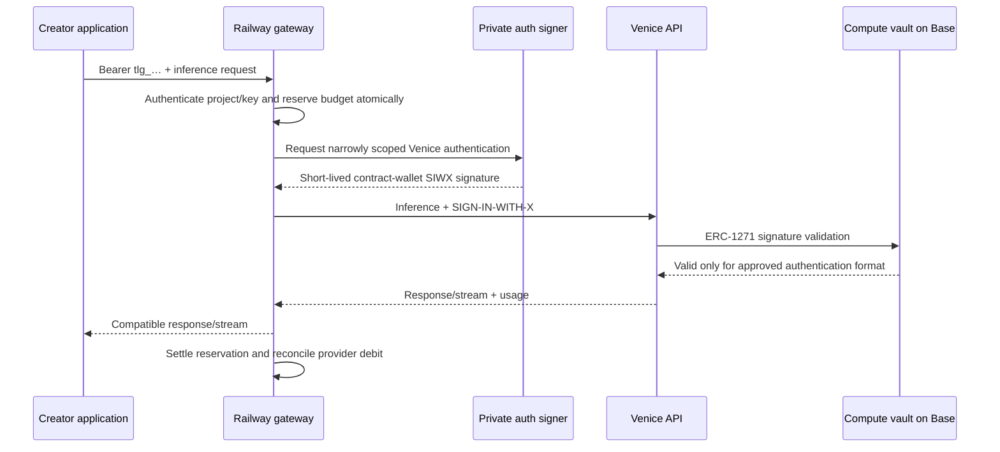

# Venice authentication and Railway

## Chosen architecture

Give the creator a Telligence bearer key and a Telligence API base URL. Railway's gateway authenticates upstream as the project's compute vault using Venice's wallet-authentication protocol. The vault keeps every backing position onchain. Its hosted inference signer has no transaction or withdrawal authority over those positions.



The upstream verifier's exact RPC/cache/session behavior is an integration test. This diagram is the intended contract-wallet flow, not an assertion that every request performs a fresh Base RPC call.

## Evidence already obtained

On September 9, 2026, a live unauthenticated POST to `https://api.venice.ai/api/v1/chat/completions` returned HTTP 402 with:

```json
{
  "supportedChains": [
    {"chainId": "eip155:8453", "type": "eip191"},
    {"chainId": "eip155:8453", "type": "eip1271"}
  ]
}
```

Its challenge identified `api.venice.ai`, the exact inference URI, and a five-minute validity window. It named `SIGN-IN-WITH-X` as the canonical header and `X-Sign-In-With-X` as a legacy header. The full response is saved in [evidence](evidence/venice-auth-challenge.json); its nonce is an expired, unauthenticated discovery value, not a credential. [Venice's official integration source](https://github.com/veniceai/skills/blob/be69bebc470353da07d7284ec1d283d5a2f0a168/skills/venice-x402/SKILL.md) independently lists Base ERC-1271 support.

Venice documents that wallet-authenticated requests can consume DIEM from a linked Venice account. Thus the planned gateway does not require putting the backing into an EOA or paying USDC for every request. It does require establishing the vault's provider-account linkage and testing credited usage. [Official wallet integration](https://docs.venice.ai/guides/integrations/x402-venice-api)

There is also public implementation precedent: another DIEM staking vault implements ERC-1271 specifically for Venice authentication. This corroborates the approach but does not prove its offchain onboarding, safety, or compatibility with our stricter signature envelope. [sDIEMv2 source](https://github.com/Figu3/diem-relay/blob/main/contracts/src/sDIEMv2.sol)

The Railway CLI login was successfully verified using `railway whoami --json`. No existing service configuration, secret value, deployment, or account setting was changed.

## Bootstrap and proof of activation

Implement onboarding as a recoverable job with an explicit success condition; do not make a user negotiate the integration with Venice.

1. Deploy a minimal canary vault using the same authentication logic and pinned integrations as production. It needs a small, explicitly budgeted Base funding transaction for a real end-to-end test; unauthenticated discovery cannot test this.
2. Stake into that vault and create a small DIEM position. Keep the vault's ownership of sVVV, the mint position, and DIEM intact.
3. Establish its Venice identity. First test Venice's official Web3-key bootstrap endpoint with the contract address. Its documented signing example uses an EOA; ERC-1271 support on this separate endpoint is not yet proven. If necessary, automate the normal self-service wallet sign-in for the contract wallet. Public Venice sign-in currently offers WalletConnect/Reown and a credentials authentication provider; this is evidence of a login route, not proof that that route accepts our vault.
4. An exact provider-challenge bootstrap was considered during design but is **not implemented or enabled**. The current vault validates only canonical, scoped Venice SIWE messages and has no generic digest/JWT approval escape hatch. The canary must establish whether those supported messages are sufficient for self-service account activation. If the provider requires a different registration signature, stop activation and specify/test that exact protocol before changing the validator. Never transfer the DIEM or principal to an EOA to bypass this boundary.
5. Fetch wallet/account balances and verify that the identity resolves to the vault's staked DIEM, not to the bootstrap signer's EOA. The provider balance must show spendable DIEM and the expected daily allocation.
6. Make one tightly capped inference request using only vault SIWX authentication, with no USD balance or USDC payment. Confirm that DIEM decreases and no onchain backing changes.
7. Test authentication disable/rotation, existing signatures, provider sessions, and any bootstrap-created credentials. Prove whether inference authentication can create persistent provider keys; if so, add explicit provider revocation to the recovery workflow before release.

The unsolved empirical step is narrow: **a newly deployed vault must self-register/link, receive its DIEM allocation, and successfully spend it through the exact signature envelope.** Contract-wallet authentication is advertised by the live API; complete funded activation has not been performed in this design task. Public launch waits for this proof. Failure does not justify silently substituting an EOA that can steal DIEM or strand sVVV.

The official Web3 bootstrap docs and exact endpoint are [here](https://docs.venice.ai/guides/integrations/generating-api-key-agent) and [here](https://docs.venice.ai/api-reference/endpoint/api_keys/generate_web3_key/post). Separate provider-account creation from daily inference; the product remains one Telligence key regardless of upstream onboarding mechanics.

## Signature policy

Do not implement `isValidSignature(hash, signature)` as unrestricted recovery of a hosted signing address. Other protocols may interpret the resulting valid signature as approval of a permit, asset order, or financial authorization.

Use a versioned envelope with the canonical SIWE fields, signer generation, validity interval, and an inner signature. Reconstruct the exact permitted message and its EIP-191 hash inside validation. Require:

- Fixed Venice domain, fixed statement/version, the actual vault address, and Base chain 8453.
- An explicit allowlist of authentication resource forms; no arbitrary extra fields or line injection.
- Strict nonce/date parsing, bounded message length, a short maximum lifetime, and no expired or far-future messages.
- The reconstructed hash equals the hash Venice asks the vault to validate.
- An inner domain-separated signature binding vault, chain, message hash, generation and interval to the currently enabled inference signer.
- Failure for unrelated hashes, typed permits, Permit2, orders, raw JWTs, and generic wallet signatures. Bootstrap authentication is separately controlled, restricted to its challenge-message format, and short-lived.

[ERC-1271](https://eips.ethereum.org/EIPS/eip-1271) permits contract-defined signature verification. Whether Venice transports arbitrary signature bytes intact is part of the canary test.

`isValidSignature` is a read-only validation function. It cannot consume nonces, meter requests, or enforce a daily budget. Venice must reject replay where its protocol requires that; the gateway maintains its own nonce/request state but cannot protect requests made directly by a stolen signer.

Likewise, a SIWE URI is not automatically an upstream endpoint permission. Test that the authenticated identity cannot use inference authentication to create a long-lived admin credential that survives signer rotation. Restricting the hash protects asset signatures; provider authorization still controls API privileges.

Per-project inference signers have no VVV/DIEM balances, JB permissions, operator status, transaction execution rights, or ability to change signers. Rotation is handled by a separate creator/recovery policy. Short signature TTLs limit leaked signatures, not stolen signing keys: a stolen key can produce new signatures until disabled.

The realistic hosted-signing loss bound is the affected projects' provider-visible credit during detection and effective revocation, plus accepted in-flight work. It is not principal loss, assuming the contracts meet the invariants. A service credential able to sign for all projects remains a common point of exposure for their compute credit.

## Railway services

| Service | Exposure | Data/credentials |
|---|---|---|
| `web` | Public | Purpose/funding UI; creator session; public project snapshots; no provider or wallet secrets |
| `gateway` | Public API | Hashed Telligence keys, project quotas, fixed provider origin; requests authentication from private signer |
| `control-worker` | Private/worker | Chain reconciliation, job leases, provider onboarding, balance refresh, key administration; gas-only keeper credential |
| `auth-signer` | Private | Per-project inference signing keys; strict schema and service authorization; no generic signing endpoint |
| `postgres` | Private | Project mappings, keys, usage reservations, idempotent jobs, chain cursors, audit events, encrypted provider credentials |

Use one region initially, health checks, graceful stream draining on deploy, and separate staging/production credentials and databases. No inference requests in cron jobs except a deliberately capped canary. Start with PostgreSQL transactions and per-project locking for quota reservations; add Redis only if load measurements justify it.

Railway provides private networking between services in a project environment. Use internal DNS for database and service traffic, with application-level service authentication as well. Private networking does not replace authorization between services. [Railway private networking](https://docs.railway.com/networking/private-networking)

For an initial capped pilot, independently generated inference keys can be encrypted at rest and decrypted only by the isolated signer. Keep the encryption secret in that service's sealed variables, not in a repository, browser, or database alongside ciphertext. Railway variables are not a hardware signing boundary. Before increasing supported credit, prefer an external non-exportable key service with narrow per-key access and audited requests; the signer interface can support it without changing the vault policy. [Railway variable handling](https://docs.railway.com/variables)

Store only a keyed hash of each random Telligence bearer secret, plus a nonsecret key ID/prefix. Show the secret once. Authenticate creator sessions separately from application keys; require recent authentication for key issuance, rotation, and recovery changes. Application key rotation never resets the project budget.

## Gateway budget and privacy rules

Initially support a small, explicit set of inference endpoints/models with bounded input size, maximum output, concurrency, request duration, and a known worst-case price. Unknown models or pricing fail closed. Expand to asynchronous image/video jobs only after their reservation and cancellation semantics are implemented.

Before forwarding, atomically reserve estimated maximum cost against both project and key budgets. Actual authorized availability is the conservative minimum of the configured budget and fresh provider capacity, less reservations and a safety margin. Settle only after observing final usage; hold uncertain charges after a timeout or broken stream until reconciliation. Do not automatically retry ambiguous paid inference. Release a reservation only when there is evidence that the provider did not incur the cost.

Provider balances remain authoritative. Local reservations prevent normal client concurrency from overspending the quota, but do not account instantly for a stolen signer operating outside the gateway. Stop new requests on stale/contradictory balances and reconcile. Use provider epoch identity and UTC resets rather than the server's local date.

Forward only allowlisted headers to the fixed Venice origin. Never forward a user's provider authorization, payment headers, arbitrary URL, or cookies. Never return upstream credentials. No automatic USDC top-up, USD fallback, or use of a shared Venice account.

Do not log prompts, completions, bearer keys, SIWX payloads, private keys, or full provider response bodies. Keep redacted request identifiers, timings, model, budget reservations, and billing usage. A reverse proxy still sees request content in memory; this product must not inherit Venice privacy claims without acknowledging that added trust boundary.

## Capacity semantics

Venice's current overview describes one staked DIEM as one dollar of daily API credit, reset at 00:00 UTC; unused allocation does not roll over, and the documented minimum for spending is 0.1 staked DIEM. Read actual provider balance/eligibility rather than assuming that an onchain stake immediately enables requests. DIEM usage does not burn the staked principal. [VVV and DIEM overview](https://docs.venice.ai/overview/vvv-diem)

Show recurring daily credit separately from today's remaining credit and rate limits. Capacity is not a fixed number of tokens: model pricing changes how much work it buys. [Venice pricing](https://docs.venice.ai/overview/pricing)

The current token flow includes DIEM unstaking before burning it to release the mint position, followed by VVV unstaking. Documentation describes one day for DIEM and seven days for VVV; implementation reads actual cooldown state and claim timestamps and handles batching. Contract source and live deployment checks must prevail over stale walkthroughs.

Some official agent examples still describe the older proportional VVV-credit mechanism and outdated call signatures. Do not implement against that prose. Pin verified contract interfaces and explicitly test the current VVV → sVVV → DIEM route.

## Contract findings for implementation

Exact-match Sourcify source and a read-only Base RPC inspection at block 51,087,999 identified the following. These are integration observations; a complete deployment manifest and independent review are still required.

| Contract | Address / behavior |
|---|---|
| Canonical VVV | `0xacfE6019Ed1A7Dc6f7B508C02d1b04ec88cC21bf` |
| VVV staking proxy | `0x321b7ff75154472B18EDb199033fF4D116F340Ff` |
| Observed staking implementation | `0xe37A7920dbc11253ac6d031C29f592f71B348DCA` |
| DIEM | `0xF4d97F2da56e8c3098f3a8D538DB630A2606a024` |

The verified staking ABI uses `stake(address recipient, uint256 amount)`: VVV comes from the caller, while nontransferable sVVV and withdrawal control belong to the recipient. Always use the vault as recipient. The staking implementation is owner-upgradeable; monitor implementation and administrator changes. [Proxy/source resolution](https://sourcify.dev/server/v2/contract/8453/0x321b7ff75154472B18EDb199033fF4D116F340Ff?fields=abi,sources,proxyResolution), [StakingV2 source](https://sourcify.dev/server/v2/contract/8453/0xe37A7920dbc11253ac6d031C29f592f71B348DCA?fields=abi,sources)

`mintDiem(sVVVAmountToLock, minDiemAmountOut)` binds the collateral and minted DIEM to the caller. `burnDiem(amount)` releases that caller's collateral according to its historical average mint rate. DIEM `stake`, `initiateUnstake`, and `unstake` use `msg.sender`; there is no independent compute beneficiary to delegate to a hosted EOA. Keep every call in the vault. Initiating unstake reduces active DIEM stake immediately, and a new request resets the pending cooldown. VVV allows one pending cooldown per account. Claim matured positions before starting another batch. Cooldown values can change administratively, so approximately eight days is a current normal unwind estimate, not an SLA. [DIEM source and ABI](https://sourcify.dev/server/v2/contract/8453/0xf4d97f2da56e8c3098f3a8d538db630a2606a024?fields=abi,sources)
